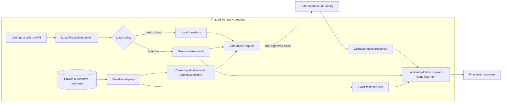

# fde-pii-hashing

An FDE learning repository for a common deployment problem: users need useful model-assisted
answers, but raw PII, database rows, exact commercial measures, SQL, and infrastructure details
must not cross the first-party trust boundary. The code makes every stage inspectable and uses a
mock model plus synthetic-only data by default.



The normal application path is: local detect → mask/hash/token → `SafeModelRequest` → provider.
Tokens can be rehydrated only inside the first-party process for the owning session; hashes never
can. In the automotive path, the model returns a digit-free template and exact values are inserted
locally after validation.

## Run without an API key

Use Python 3.12 and [uv](https://docs.astral.sh/uv/) as the canonical installer and runner:

```bash
uv sync

PII_HASH_SALT=replace-with-at-least-16-bytes \
  uv run python -m fde_privacy.pii_demo

uv run python -m fde_privacy.automotive_demo
uv run pytest -m "not integration" -v
```

No model key is needed. The PII command prints trusted input, local detection metadata, the exact
model-facing payload, and the final locally composed response. The automotive command prints its
local database result, reduced facts, model payload, and exact final response.

Important dependency constraint: ordinary pip/wheel install is unsupported while Presidio
2.2.363's `cryptography<47` metadata conflicts with patched cryptography 48.0.1. The uv override in
`pyproject.toml` is deliberate, and the lock plus tests prove the supported combination. Remove the
uv override when upstream Presidio supports the patched range.

## What the LLM sees

The default PII input is fictional:

```text
Alice Johnson has email alice.johnson@example.com. The customer's phone number is
+61 412 345 678. Customer record CUST-000123.
```

Presidio runs locally. Policy tokenizes the person, email, and phone, and hashes the customer ID.
The opaque token and digest values vary, but the provider receives only a `SafeModelRequest` shaped
like this:

```json
{
  "system_instruction": "Summarize only the transformed user text. Do not infer or reconstruct protected values.",
  "safe_text": "{{PERSON:opaque-session-token}} has email {{EMAIL_ADDRESS:opaque-session-token}}. The customer's phone number is {{PHONE_NUMBER:opaque-session-token}}. Customer record <64-character-sha256-digest>.",
  "automotive_facts": null
}
```

The mock echoes `safe_text`. Locally, the owning session can restore the three tokens, so the final
response contains the original fictional name, email, and phone. The customer ID remains a digest:

```text
Alice Johnson has email alice.johnson@example.com. The customer's phone number is
+61 412 345 678. Customer record <64-character-sha256-digest>.
```

Raw PII may exist in the trusted input and the in-memory token vault. It does not belong in the
provider request, logs, fixtures, or CI output.

## Masking vs hashing vs tokenization

| Control | Model sees | Reversible locally? | Best fit |
|---|---|---:|---|
| Masking | `<EMAIL_ADDRESS>` | No | Identity is irrelevant |
| Hashing | Salted SHA-256 digest | No | One-way comparison or demonstration |
| Tokenization | Opaque session token | Yes, with the owning live session | A later local step needs the original |

LiteLLM 1.92.0's built-in Presidio action supports MASK/BLOCK, not HASH. This repository
demonstrates hashing in the application with the Presidio Anonymizer before constructing
`SafeModelRequest`. A random salt breaks repeat correlation; a fixed secret salt creates a stable,
linkable pseudonym and must not be committed. For deterministic production pseudonyms, prefer HMAC
with a managed secret key and an explicit key-rotation design.

## PII is not the same as confidential business data

PII controls answer “who is this?” Confidentiality controls answer “which internal facts should
leave our system?” A hashed customer ID is still linkable pseudonymous data, and hashing an exact
sales total does not make the underlying rows, SQL, margins, or dealer performance appropriate for
a prompt. Use local querying, aggregation, suppression, bucketing, and a strict outbound allowlist
for business data, alongside PII detection for free text.

## Automotive database example

The synthetic SQLite query runs in first-party code. Its exact local result is:

```text
Month | Vehicle sales
--- | ---:
2025-07 | 8
2025-08 | 10
2025-09 | 9
2025-10 | 12
2025-11 | 12
2025-12 | 15
2026-01 | 11
2026-02 | 10
2026-03 | 13
2026-04 | 14
2026-05 | 16
2026-06 | 18
```

The exact totals, source rows, fixed SQL, and database host remain first-party. The model sees this
closed qualitative object plus placeholders:

```json
{
  "period_start": "2025-07",
  "period_end": "2026-06",
  "monthly_direction_sequence": ["UP", "DOWN", "UP", "FLAT", "UP", "DOWN", "DOWN", "UP", "UP", "UP", "UP"],
  "peak_month": "2026-06",
  "trough_month": "2025-07",
  "quarter_direction_sequence": ["UP", "DOWN", "UP"],
  "volatility_band": "MODERATE",
  "overall_trend": "GROWING",
  "data_quality_flags": ["NONE"],
  "allowed_placeholders": ["{{PEAK_MONTH_TOTAL}}", "{{TROUGH_MONTH_TOTAL}}", "{{PERIOD_START_TOTAL}}", "{{PERIOD_END_TOTAL}}"]
}
```

The model response grammar rejects digits and unrequested placeholders. A valid response is:

```json
{
  "headline": "Sales strengthened across the period",
  "observations": [
    "The strongest month reached {{PEAK_MONTH_TOTAL}} vehicle sales.",
    "The period ended at {{PERIOD_END_TOTAL}} vehicle sales."
  ],
  "caveat": null
}
```

Only after validation does local code insert the exact values, producing “The strongest month
reached 18 vehicle sales” and “The period ended at 18 vehicle sales,” alongside the exact local
table. If the model fails, the same table and a deterministic local fallback are still available.

## Optional LiteLLM gateway

The Docker path proves LiteLLM's built-in local Presidio `MASK`/`BLOCK` behavior. It starts analyzer,
anonymizer, LiteLLM, and an in-memory capture upstream, all bound to localhost and pinned by image
digest:

```bash
docker compose up -d --wait
uv run pytest tests/integration/test_litellm_presidio.py -v -m integration
docker compose down --volumes
```

The integration proof sends fictional low-risk PII to the first-party LiteLLM gateway and verifies
that capture receives only masks. A standard test credit-card value is blocked before capture.
This gateway is a trusted local processor: it may receive raw inbound text, runs Presidio before
the upstream call, and is distinct from the provider-facing Python adapter.

## Optional real provider

Provider access is disabled unless the gate is exactly `ENABLE_EXTERNAL_MODEL=true`. The checked-in
example remains `ENABLE_EXTERNAL_MODEL=false`; missing or malformed configuration fails before input
is processed. First prove the adapter against the local capture gateway:

```bash
ENABLE_EXTERNAL_MODEL=true \
LITELLM_BASE_URL=http://localhost:4000 \
LITELLM_MODEL=capture-model \
PII_HASH_SALT=replace-with-at-least-16-bytes \
uv run python -m fde_privacy.pii_demo --provider litellm
```

For an approved HTTPS gateway, set `LITELLM_BASE_URL`, `LITELLM_MODEL`, and, only when required,
`LITELLM_API_KEY` in a local `.env`. Never commit the key. The adapter accepts exactly
`SafeModelRequest`; enabling it does not weaken the local boundary.

## Security and supply chain

- All identifiers and sales records are fictional, synthetic-only data. Do not substitute real
  customer or dealership data.
- Python dependencies are locked. The cryptography floor addresses
  [GHSA-537c-gmf6-5ccf](https://github.com/advisories/GHSA-537c-gmf6-5ccf), and the pytest floor
  addresses [GHSA-6w46-j5rx-g56g](https://github.com/advisories/GHSA-6w46-j5rx-g56g).
- LiteLLM `1.82.7` and `1.82.8` were compromised and are excluded; see the
  [LiteLLM incident record](https://github.com/BerriAI/litellm/issues/24518). The current LiteLLM
  1.92.0 container is pinned to a reviewed digest in `docker-compose.yml`.
- Cosign verification was not run for this documentation task because Cosign was unavailable. The
  following is an optional independent signature check using LiteLLM's key at a fixed commit:

```bash
cosign verify \
  --key https://raw.githubusercontent.com/BerriAI/litellm/0112e53046018d726492c814b3644b7d376029d0/cosign.pub \
  ghcr.io/berriai/litellm:v1.92.0
```

Implementation references: [Presidio anonymizer](https://data-privacy-stack.github.io/presidio/anonymizer/),
[Presidio repository](https://github.com/data-privacy-stack/presidio),
[Presidio hash operator](https://github.com/data-privacy-stack/presidio/blob/517d13eee659794ed3a55d188752d014be574c2a/presidio-anonymizer/presidio_anonymizer/operators/hash.py),
[LiteLLM Presidio tutorial](https://docs.litellm.ai/docs/tutorials/presidio_pii_masking), and
[current LiteLLM PII actions](https://github.com/BerriAI/litellm/blob/4d339648981ceb8c45df3081b388680084a2206d/litellm/types/guardrails.py).

## Limitations

- Presidio automated detection has false negatives and false positives. Production needs layered
  controls: structured-field policy, allowlists, deny rules, output checks, monitoring, review, and
  data-loss prevention appropriate to the risk.
- Keeping spaCy and Python local does not guarantee memory zeroization. Cached vocabulary may retain
  tokens in first-party memory; use process isolation and restart when zeroization is in the threat
  model.
- The token vault is in-memory only. Its entries have a 300-second TTL and are activity-pruned on
  vault operations; authentication in the demo is simulated by an injected session context.
- Hashes and stable pseudonyms can remain personal data. Fixed salts do not prevent guessing attacks
  against low-entropy values.
- SQLite, the mock adapter, fixed SQL, and deterministic fallback are teaching substitutions, not a
  compliance claim or a complete production architecture.

For the module-by-module walkthrough, read [What we are achieving](docs/what-we-are-achieving.md).
For assets, threats, controls, and production replacements, read
[Threat model](docs/threat-model.md).
