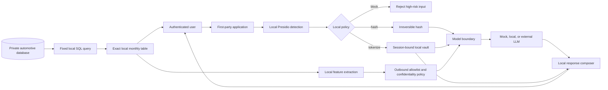

# Presidio PII Learning Lab - Design Specification

Date: 2026-07-17  
Repository: `PeterP22/presidio-pii-learning-lab`  
Status: Approved design, awaiting implementation planning

## 1. Purpose

Build a public, runnable learning repository that explains and proves how to keep sensitive data out of an external LLM request.

The repository has two connected learning paths:

1. A PII transformation lab using Microsoft Presidio and LiteLLM.
2. An automotive analytics lab that queries a private database locally, shows exact results directly to the authenticated user, and gives an LLM only an approved, reduced fact set for narrative generation.

The project must make each trust boundary visible. A learner should be able to inspect the original input, Presidio detections, transformed model payload, model response, and locally composed final response without relying on a real external model.

## 2. Core distinction

PII and confidential business data are different risks and require different controls.

| Data class | Example | Primary control |
|---|---|---|
| Customer PII | Name, email, phone, driver licence | Detect, block, mask, hash, or tokenize locally |
| Pseudonymous identifiers | Hashed customer or salesperson ID | Keep local where possible; treat as linkable sensitive data |
| Confidential business data | Row-level vehicle sales, prices, margins, dealer performance | Local query, aggregation, suppression, bucketing, and an outbound allowlist |
| Infrastructure secrets | Database hostname, private IP, credentials, connection string | Never place in prompts, logs, fixtures, or repository files |

Hashing PII does not make confidential sales results safe. Conversely, aggregating sales data does not remove PII from free-text notes. Both controls are required.

## 3. Outcomes

The completed repository will demonstrate that:

- Presidio can detect PII spans and confidence scores locally.
- LiteLLM's built-in Presidio integration supports masking and blocking.
- Presidio's anonymizer can hash detected values with SHA-256 or SHA-512 before the LiteLLM boundary.
- A hash is irreversible and cannot be used to restore a customer's details.
- Random salt prevents stable correlation but produces a different hash each time.
- A fixed secret salt produces a stable, linkable pseudonym and must not be committed.
- Session-bound tokens can be restored locally after authorization.
- Raw PII, raw database rows, exact monthly totals, SQL text, and database network details do not enter the external-model payload.
- Exact monthly totals can still be shown to the user by rendering them locally and combining them with a model-written narrative template after the model call.

## 4. Non-goals

- Claiming that automated PII detection is perfect.
- Treating hashing as encryption or as a reversible token vault.
- Letting an LLM generate unrestricted SQL or connect directly to the database.
- Sending real customer data, dealership data, API keys, or database credentials to GitHub or CI.
- Providing a production compliance certification.
- Building a full automotive sales platform.

## 5. Repository structure

```text
presidio-pii-learning-lab/
├── README.md
├── pyproject.toml
├── uv.lock
├── docker-compose.yml
├── .env.example
├── .gitignore
├── config/
│   └── litellm.yaml
├── data/
│   └── synthetic_automotive_sales.csv
├── src/pii_lab/
│   ├── detect.py
│   ├── hash_pii.py
│   ├── token_vault.py
│   ├── policies.py
│   ├── model_boundary.py
│   ├── local_composer.py
│   ├── automotive_demo.py
│   └── automotive_analytics.py
├── tests/
│   ├── test_detection.py
│   ├── test_hashing.py
│   ├── test_tokenization.py
│   ├── test_model_boundary.py
│   └── test_automotive_analytics.py
├── docs/
│   ├── what-we-are-achieving.md
│   ├── threat-model.md
│   └── superpowers/specs/
└── .github/workflows/tests.yml
```

The implementation will keep modules small so each concept can be read independently.

## 6. Architecture



### 6.1 PII path

1. The first-party application receives fictional automotive-sales text.
2. Presidio Analyzer runs locally and returns entity type, offsets, and confidence.
3. A local policy decides whether each entity is blocked, hashed, masked, or tokenized.
4. `model_boundary.py` constructs the only payload a provider-facing model adapter can receive.
5. The boundary scans the payload and fails closed if known raw PII or forbidden fields remain.
6. A mock model is the default. Optional LiteLLM or Azure OpenAI calls require explicit environment configuration.
7. Hashes remain hashes. Tokens are restored only by the local composer after simulated session ownership is verified.

There are two explicit request contracts:

- `InboundUserRequest` may contain raw PII. It is accepted only by the first-party application or the local LiteLLM gateway and may be passed only to local Presidio processing.
- `SafeModelRequest` contains only transformed text and allowlisted analytical fields. It is the only request type accepted by provider-facing adapters.

The LiteLLM tutorial path is a special local-gateway integration. The local LiteLLM process receives `InboundUserRequest`, invokes the local Presidio pre-call guardrail, and only then calls its configured upstream. An integration test uses a local capture server as the upstream provider and asserts that the captured outbound request is masked. Raw PII is therefore permitted inside the named first-party gateway process but not beyond it. The custom Python path converts `InboundUserRequest` to `SafeModelRequest` before invoking any model adapter.

Authentication is deliberately simulated rather than implemented. The demo creates a trusted `SessionContext` containing `owner_id`, `session_id`, and `issued_at`. Tests and command-line examples inject this context directly. The token vault binds every token map to that context and rejects a different or expired context. A production application would construct the same context only after verifying its real identity token or session cookie.

### 6.2 Automotive database path

The first database is SQLite populated entirely with synthetic data. The schema represents vehicle sales from 2025-07-01 through 2026-06-30 and includes fictional dealer, salesperson, customer, vehicle, sale date, unit price, and margin fields.

The LLM never receives a database connection, SQL tool, hostname, private IP, credentials, schema dump, or row-level result.

The data flow is:

1. A fixed, parameterized local query calculates exact monthly unit totals for the previous twelve complete months.
2. The application returns the exact table directly to the authenticated user without routing it through the LLM.
3. Local Python code calculates approved analytical features such as direction of change, peak month, trough month, quarter-over-quarter direction, volatility band, and data-quality warnings.
4. Exact totals are replaced with placeholders such as `{{PEAK_MONTH_TOTAL}}` when a natural-language sentence requires them.
5. An outbound policy allowlists only feature names, qualitative bands, month labels, and placeholders.
6. The LLM generates a narrative template from those facts.
7. The first-party composer inserts exact totals locally and combines the narrative with the local table.

This design allows the user to receive an exact answer while the external LLM never receives the exact monthly totals.

The demo defines "previous twelve complete months" relative to an injectable `as_of` value and the `Australia/Sydney` timezone. The documented demo uses `as_of=2026-07-17`, producing the fixed period 2025-07 through 2026-06. Tests always supply this value explicitly; production adapters may supply the current trusted application clock.

## 7. Transformation modes

### 7.1 Masking

Example:

```text
Input:  John Smith can be reached at john@example.com
Output: <PERSON> can be reached at <EMAIL_ADDRESS>
```

Masking is appropriate when the model does not need identity continuity. LiteLLM's built-in Presidio guardrail will be used for this path.

### 7.2 Hashing

Example:

```text
Input:  customer-1042
Output: 0d71...e7c9
```

Presidio's hash operator will be demonstrated with:

- Random salt: different result on each call and no stable correlation.
- Fixed secret salt: stable result for repeat comparisons, but linkable and vulnerable to guessing when the source value has low entropy.

The fixed salt must be at least 16 bytes and supplied through an environment variable. It will never be included in `.env.example` as a usable value.

The README will state that HMAC with a secret key is usually preferable when a production system needs deterministic pseudonyms. Presidio hashing is retained because the goal is to understand Presidio's operator and its limitations.

### 7.3 Tokenization

Example:

```text
Input:  John Smith
Token:  {{PERSON_1}}
Vault:  session-abc -> {{PERSON_1}} -> John Smith
```

Tokens are random, scoped to one session, expire after a short TTL, and are not meaningful outside the first-party service. The in-memory vault is educational, not a production database. Rehydration requires the same session owner.

## 8. Model boundary contract

Every provider-facing model adapter accepts one `SafeModelRequest` object. It cannot accept database connections, arbitrary dictionaries, ORM rows, `InboundUserRequest`, or application request objects. The local LiteLLM gateway is not a provider-facing adapter: it is a named first-party processor whose responsibility is to convert raw inbound text into a masked outbound provider request.

Allowed fields:

- System instruction selected from repository-owned templates.
- Redacted or tokenized user text.
- The closed automotive analytical schema defined below.
- Non-sensitive month labels.
- Opaque placeholders for confidential exact values.

Forbidden fields:

- Original PII.
- Database host, private IP, port, credentials, or connection string.
- SQL text or schema metadata.
- Raw query rows.
- Exact monthly units, revenue, price, margin, or dealer totals.
- Customer, salesperson, VIN, registration, or dealer identifiers, even if merely hashed, unless a future policy explicitly permits them.

The boundary serializes its final payload in tests so leakage assertions operate on the exact bytes that would be transmitted.

### 8.1 Closed automotive outbound schema

The automotive model payload is a typed `AutomotiveNarrativeFacts` object with no extra fields permitted:

| Field | Type | Permitted values |
|---|---|---|
| `period_start` | String | `YYYY-MM`; demo value `2025-07` |
| `period_end` | String | `YYYY-MM`; demo value `2026-06` |
| `monthly_direction_sequence` | Array of 11 strings | `UP`, `DOWN`, or `FLAT` |
| `peak_month` | String | One month within the analysis period |
| `trough_month` | String | One month within the analysis period |
| `quarter_direction_sequence` | Array of 3 strings | `UP`, `DOWN`, or `FLAT` |
| `volatility_band` | String | `LOW`, `MODERATE`, or `HIGH` |
| `overall_trend` | String | `GROWING`, `DECLINING`, or `MIXED` |
| `data_quality_flags` | Array of strings | `NONE`, `MISSING_MONTH`, or `DUPLICATE_RECORDS` |
| `allowed_placeholders` | Array of strings | Values from the placeholder registry below |

The schema permits no free-form metadata, identifiers, counts, currency values, percentages, database fields, or nested source records. Unknown fields and unknown enum values are validation errors.

### 8.2 Model response grammar and placeholder registry

The model returns a typed `NarrativeTemplate`:

- `headline`: plain text with no placeholders and no digits.
- `observations`: one to four plain-text sentences.
- `caveat`: optional plain text selected only when data-quality flags are present.

The only placeholders permitted inside `observations` are:

- `{{PEAK_MONTH_TOTAL}}`
- `{{TROUGH_MONTH_TOTAL}}`
- `{{PERIOD_START_TOTAL}}`
- `{{PERIOD_END_TOTAL}}`

The local response validator rejects unknown placeholders, digits in the model response, and placeholders that were not listed in the request's `allowed_placeholders`. The local composer owns the placeholder-to-exact-value mapping and substitutes values only after response validation. This keeps exact totals out of both the model request and response while allowing the final first-party response to contain them.

## 9. Error handling

- Presidio unavailable: fail closed and do not call the model.
- Detection confidence below policy threshold: mark for review or block high-risk categories.
- Credit card, bank, tax, Medicare, or licence data: block by default rather than hash.
- Missing or expired token: do not rehydrate; return a safe error.
- Wrong simulated session owner: deny access and leave tokens unresolved.
- Database query failure: return no model narrative because there is no verified fact set.
- Empty or incomplete twelve-month result: surface a data-quality warning and do not infer missing values.
- Outbound contract violation: fail closed, record only the forbidden field name, and never log its value.
- Model unavailable: still return the exact local table plus a deterministic local fallback summary.

## 10. Testing strategy

### Unit tests

- Presidio detects representative names, emails, phones, and Australian identifiers.
- Random salt creates different hashes for the same value.
- Fixed secret salt creates the same hash for the same value.
- Different inputs do not share a hash.
- Hash output cannot be passed to the token rehydration function.
- Session tokens restore only for the owning session and before expiry.
- High-risk PII policies block requests.
- Forbidden fields cannot construct a valid `SafeModelRequest`.

### Automotive integration tests

- With `as_of=2026-07-17` and timezone `Australia/Sydney`, the synthetic database query returns exactly twelve ordered months from 2025-07 through 2026-06.
- Monthly totals match independently calculated fixture values.
- No row-level record appears in the outbound model payload.
- No exact monthly total appears in the outbound model payload.
- No database filename, hostname, private IP, connection string, SQL statement, VIN, customer ID, or salesperson ID appears in the outbound payload.
- The model receives only approved trend features and placeholders.
- Unknown outbound feature fields, enum values, response placeholders, response digits, and unrequested placeholders are rejected.
- The local composer inserts exact values only after the model returns.
- The final user response contains the exact table and a coherent narrative.

### CI tests

GitHub Actions runs only mock-model and synthetic-data tests. CI requires no external LLM key and performs no outbound model call.

## 11. Public repository safety

- Use only fictional names, identifiers, vehicle sales, and database addresses.
- Include `.env.example` with variable names but no usable secret.
- Ignore `.env`, local databases, logs, caches, traces, and generated payload captures.
- Add a secret scan and dependency audit to CI where practical.
- Pin dependencies and container images to explicit reviewed versions or digests.
- Exclude compromised LiteLLM versions `1.82.7` and `1.82.8`.
- Use the current Presidio GHCR images rather than the older Microsoft Container Registry examples in the LiteLLM tutorial.
- Document that hashed or pseudonymous data can remain personal data because it is linkable.

## 12. Learning experience

The README will present a numbered path:

1. Run PII detection.
2. Compare masking, random-salt hashing, fixed-salt hashing, and tokenization.
3. Inspect the exact mock-model payload.
4. Prove rehydration succeeds for tokens and fails for hashes.
5. Start local Presidio and LiteLLM services with Docker Compose.
6. Repeat masking through the LiteLLM gateway.
7. Create the synthetic automotive database.
8. Query monthly sales locally.
9. Inspect the safe analytical fact set sent to the mock model.
10. Compare the model-facing prompt with the exact final user response.
11. Optionally enable a real provider only after the mock tests pass.

Each command will explain what changed, which process saw which data, and why that boundary exists.

## 13. Implementation phases

### Phase 1 - PII fundamentals

- Detection, mask, hash, token vault, model boundary, mock model, and tests.

### Phase 2 - LiteLLM integration

- Pinned Presidio services, pinned LiteLLM gateway, built-in mask/block configuration, and observable requests.

### Phase 3 - Automotive analytics

- Synthetic SQLite database, fixed monthly aggregation query, local feature extraction, outbound confidentiality policy, narrative template, and local composition.

### Phase 4 - Optional provider

- Environment-controlled LiteLLM model configuration, disabled by default, with explicit confirmation that only safe payloads are transmitted.

### Phase 5 - Public release

- Final security review, dependency verification, README walkthrough, CI, initial commit history, creation of the public GitHub repository, and push to `PeterP22`.

## 14. Success criteria

The design is complete when a new learner can clone the public repository and:

1. Run all tests without an API key.
2. See why masking, hashing, and tokenization are not interchangeable.
3. Verify that model-facing data contains no raw PII.
4. Query exact synthetic monthly automotive sales locally.
5. Verify that the model-facing payload contains no raw rows, exact totals, database network details, or identifiers.
6. Receive a final response containing exact local results plus an LLM-style summary assembled without exposing those results to the model.

## 15. Source constraints

- LiteLLM Presidio tutorial: <https://docs.litellm.ai/docs/tutorials/presidio_pii_masking>
- LiteLLM current PII actions (`MASK`, `BLOCK`): <https://github.com/BerriAI/litellm/blob/4d339648981ceb8c45df3081b388680084a2206d/litellm/types/guardrails.py>
- Presidio current hash operator: <https://github.com/data-privacy-stack/presidio/blob/517d13eee659794ed3a55d188752d014be574c2a/presidio-anonymizer/presidio_anonymizer/operators/hash.py>
- Presidio anonymizer documentation: <https://data-privacy-stack.github.io/presidio/anonymizer/>
- LiteLLM March 2026 supply-chain incident: <https://github.com/BerriAI/litellm/issues/24518>
